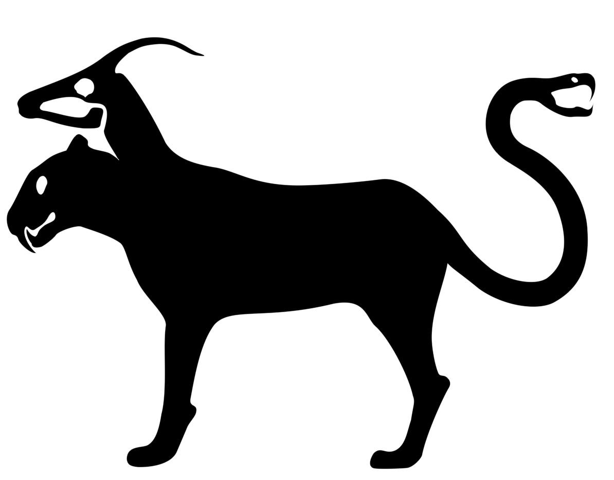
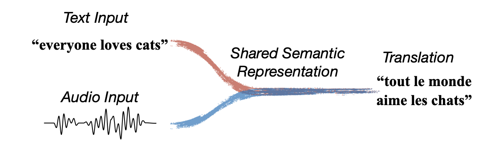
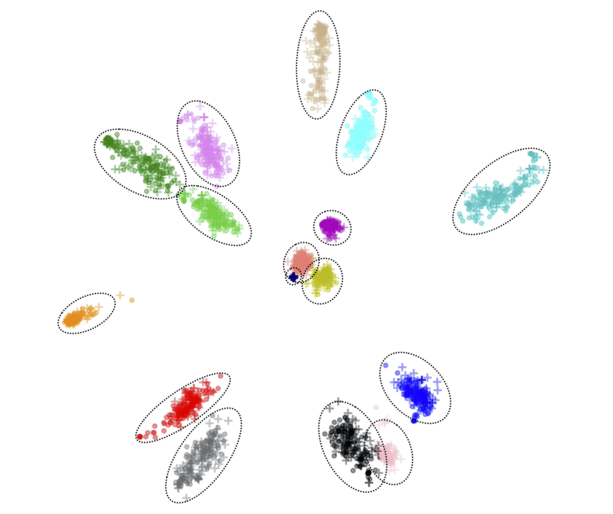
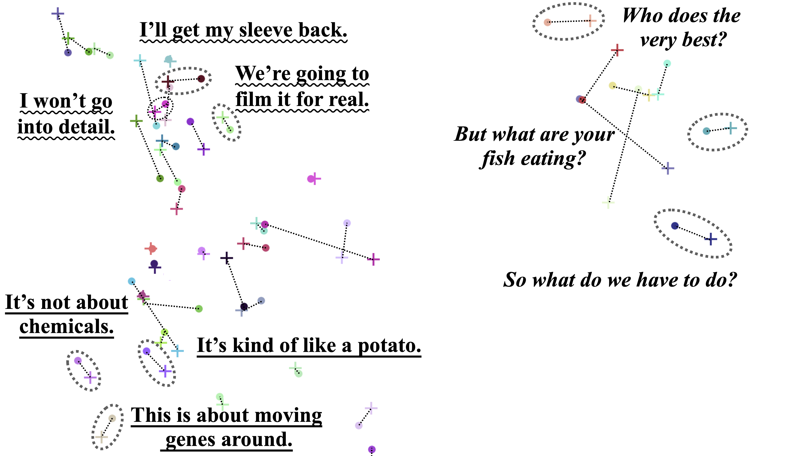

# Chimera: Learning Shared Semantic Space for Speech-to-Text Translation (Nightly Version)

<div align="center">
  
</div>
<br />

This is a Pytorch implementation for the "Chimera" paper
" Learning Shared Semantic Space for Speech-to-Text Translation "
https://arxiv.org/abs/2105.03095
(accepted by ACL Findings 2021),
which aims to bridge the modality gap by unifying the task of MT (textual Machine Translation) and ST (Speech-to-Text Translation).
It has achieved new SOTA performance on all 8 language pairs in MuST-C benchmark, by utilizing an external MT corpus.

<div align="center">
  
</div>
<br />

This repository is up to now a nightly version,
and is bug-prone because of code refactoring.
Also it is not fully tested on configurations other than the authors' working environment yet.
However, we encourage you to first have a look at the results and model codes to get a general impression of what this project is about.

The code base is forked from FairSeq repository
https://github.com/pytorch/fairseq.git
(without an actual forking operation) in Septempber 2020.
It than lags behind the later updates in FairSeq,
and both the codes and checkpoints are not compatible with currect Fairseq version.
You will need to modify the model codes for checkpoint configurations
if you want to follow the new FairSeq codes.

**CONTRIBUTION:** You are also more than welcomed to test our code on your machines,
and report feedbacks on results, bugs and performance!

<br /> <br />

# Results

Our model (Chimera) achieves new state-of-the-art results on all 8 language pairs on MuST-C:

| Direction | EN-DE | EN-FR | EN-RU | EN-ES | EN-IT | EN-RO | EN-PT | EN-NL |
| --------- | ----- | ----- | ----- | ----- | ----- | ----- | ----- | ----- |
| BLEU      | 26.3  | 35.6  | 17.4  | 30.6  | 25.0  | 24.0  | 30.2  | 29.2  |

Chimera novelly learns M distinct "memories" to store specific types of semantic information
from both audio and text inputs.
Shown below is a visualization of the "Memories" learned by Chimera-16,
which is a variant with M = 16.
Each learned cluster represents a individual type of information,
while each marker is a sentence sample.
"+" and "." means text and audio samples, respectively.


<div align="center">
  
</div>

<!--
Click the image to view the dynamic video on YouTube.
[](https://www.youtube.com/watch?v=qwIB-Kd514s)
-->

We can see more clearly from below (left) that memories learn a well-clustered semantic space,
forming a "semantic" alignment (rather than spatial) between audio and text inputs,
while ignoring the modality differences.

On the right, we zoom in to focus one cluster in specific,
and it can be easily observed that the vectors are well structured as well,
with inputs with (probably one of) similar semantic features close in space to each other.

<p float="left">
  
  
</p>


<br /> <br />

# Trained Checkpoints

Our trained checkpoints are available at:

| Translation Direction | filename | External url |
| --------------------- | -------- | ------------ |
| English-to-Deutsch    | Chimera_EN2DE.pt | http://sf3-ttcdn-tos.pstatp.com/obj/nlp-opensource/acl2021/chimera/Chimera_EN2DE.pt |
| English-to-French     | Chimera_EN2FR.pt | http://sf3-ttcdn-tos.pstatp.com/obj/nlp-opensource/acl2021/chimera/Chimera_EN2FR.pt |
| English-to-Russian    | Chimera_EN2RU.pt | http://sf3-ttcdn-tos.pstatp.com/obj/nlp-opensource/acl2021/chimera/Chimera_EN2RU.pt |
| English-to-Espanol    | Chimera_EN2ES.pt | http://sf3-ttcdn-tos.pstatp.com/obj/nlp-opensource/acl2021/chimera/Chimera_EN2ES.pt |
| English-to-Italiano   | Chimera_EN2IT.pt | http://sf3-ttcdn-tos.pstatp.com/obj/nlp-opensource/acl2021/chimera/Chimera_EN2IT.pt |
| English-to-Romanian   | Chimera_EN2RO.pt | http://sf3-ttcdn-tos.pstatp.com/obj/nlp-opensource/acl2021/chimera/Chimera_EN2RO.pt |
| English-to-Portuguese | Chimera_EN2PT.pt | http://sf3-ttcdn-tos.pstatp.com/obj/nlp-opensource/acl2021/chimera/Chimera_EN2PT.pt |
| English-to-Dutch      | Chimera_EN2NL.pt | http://sf3-ttcdn-tos.pstatp.com/obj/nlp-opensource/acl2021/chimera/Chimera_EN2NL.pt |


<br /> <br />

# Interactive Translation

You can download any one checkpoint mentioned above to local,
and translate local audios (only .wav files supported) to another language!
To do this, you only need to run the model in an interactive mode.
For example, you want to translate from English to Deutsh (DE)
with an already trained checkpoint at $CHECKPOINT:
``` bash
bash run.sh --script chimera/scripts/interactive-en2any-ST.sh \
    --target de --checkpoint $CHECKPOINT
```


The program will prompt an input file name like this:
```
2021-04-02 10:00:00 | INFO | fairseq_cli.interactive | Type the input sentence and press return:
```

After inputing the file name, the program will translate outputs like:
```
H-0     -1.0      ▁Nach ▁dem ...
D-0     -1.0      Nach dem ...
P-0     -1.0000 -1.0000 ...
```

**NOTE:** Do not input a file too large.
Normally the model can translate 1~5 normal-length sentences in one time.
If the input sentence is too long, the program could crash.

To exit the interactive mode, you only need to input an invalid file name.

To translate to other languages, remember to replace `de` with their language codes
(in lower case):
| Language | Code |
| -------- | ---- |
| Deutsch (German)      | DE / de |
| French                | FR / fr |
| Espanol (Spanish)     | ES / es |
| Russian               | RU / ru |
| Italiano (Italian)    | IT / it |
| Romanian              | RO / ro |
| Portuguese            | PT / pt |
| Dutch (Netherlands)   | NL / nl |

<br /> <br />

# Training a Model on MuST-C

Let's first take a look at training an English-to-Deutsch model as an example.


## Data Preparation

0. Prerequisites and Configuration
First check that requirements are met
for `pip` in `requirements.txt` and for `apt` in `apt-requirements.txt`.
Some items in the two files may be redundant,
but we haven't got time to check and eliminate them.

For configuration, please set the global variables of
`$WMT_ROOT`, `$MUSTC_ROOT` and `SAVE_ROOT`
These will be where to put the datasets and checkpoints.
For example:
``` bash
export MUSTC_ROOT="speech_data/mustc"
export WMT_ROOT="wmt_data"
export SAVE_ROOT="checkpoints"
export target=de
mkdir -p $MUSTC_ROOT $WMT_ROOT $SAVE_ROOT
```
**NOTE:** This simple configuration is a prerequisite for most of the following steps.
Here `export target=de` means the translation direction is English to Deutsch.


1. Download and uncompress the EN-to-DE MuST-C dataset to `$MUSTC_ROOT/en-$target`.
**TIP:** to speed up uncompressing a file too large,
you can replace `tar xzvf` with: ` pigz -dc $TARFILE | tar xvf - `


2. Download the WMT to `$WMT_ROOT/orig` via:
``` bash
bash chimera/prepare_data/download-wmt.sh --wmt14 --data-dir $WMT_ROOT --target $target
```
This may sometimes be too slow as the connection to `statmt.org` is not steady in some places.
In this case you can turn to other faster download sources if possible.


3. Append MuST-C text data to $WMT_ROOT, and prepare the datasets and produce a joint spm dictionary:
``` bash
bash chimera/prepare_data/prepare-wmt-en2any.sh \
    --data-dir $WMT_ROOT --wmt14 --original-dev \
    --external mustc --target $target --subword spm
python3 chimera/prepare_data/prep_mustc_data.py \
    --data-root $MUSTC_ROOT --task wave \
    --ignore_fbank80 --joint_spm wmt14-en-$target-spm \
    --languages $target --vocab-type unigram --vocab-size 10000
```
**NOTE:** if the first command is executed correctly, you will see one line in the output:
```
Existing spm dictionary chimera/resources/wmt14-en-de-spm detected. Copying...
```
If not, the program will still produce one dictionary on the run and reports
`No existing spm detected. Learning unigram spm on wmt14_en_de/tmp/train.de-en ...`
This is okay in most cases,
with the only risk being a potential mismatch to already trained checkpoints we provided.


## Training

To reproduce the results in the last row in Figure 1 in paper,
you can directly use the training scripts available as follows.

4. Pre-training on MT data:
``` bash
bash run.sh --script chimera/scripts/train-en2any-MT.sh \
    --target $target --dataset wmt14 --max_updates 500000
```

If you like, you can specify some arguments other than default values.
The default setting is `--seed 1 --num-gpus 8`, which makes the command look like
`bash run.sh --script chimera/scripts/train-en2$target-MT.sh --seed 1 --num-gpus 8`.
Value for `--num-gpus` is recommended to be power of 2, and smaller than 8, e.g. {1, 2, 4, 8}.


5. Fine-tuning on MuST-C data:

``` bash
bash run.sh --script chimera/scripts/train-en2any-ST.sh \
    --target $target --dataset wmt14 --max_updates 150000
```
This script moves the MT-pre-trained model from `${MT_SAVE_DIR}/checkpoint_best.pt`
to `${ST_SAVE_DIR}`
as a initialization for ST fine-tuning.

Optionally, if you need to resume a single ST training,
you can add argument `--resume` to the command
to avoid overwriting the existing `${ST_SAVE_DIR}/checkpoint_last.pt`.

The scripts in step 4 and 5 forks a separate background evaluation process while running.
The process monitors `$MT_SAVE_ROOT` or `$ST_SAVE_ROOT`
and evaluates any new checkpoints.
Don't worry, it will be automatically killed after the training finishes,
unless the script is Ctrl-C'ed,
in which case, you can manually raise the suicide flag by
`touch chimera/tools/auto-generate-suicide.code`
to kill the background generation process.

Note that this automatic process only evaluates a single checkpoint
(with no averaging),
and with a low beam width.

6. Averaging Checkpoints and Evaluate It

Suppose the best ST checkpoint is at epoch `$BEST_EPOCH`,
and we want to averaging 7 checkpoints around it.
``` bash
python3 chimera/tools/eval-average-checkpoint.py \
    --ckpt-dir $ST_SAVE_ROOT --number-of-ckpts 7 \
    --center-of-ckpts $BEST_EPOCH
```


## Other Language Pairs
For language pairs English-to-{French, Russian, Espanol},
you only need to replace the `export target=de` with {`fr`, `ru`, `es`} in step 0,
and then run the steps 1~5.

For language pairs English-to-{Italiano, Portuguese, Dutch, Romanian},
the MT data is different, so we need to modify Step 2 and 3.
All other Steps remains unchanged.


### English to Romanian

For Romanian, we use WMT16 corpora in our paper.

The Step 2 changes to
``` bash
bash chimera/prepare_data/download-wmt.sh --wmt16 --data-dir $WMT_ROOT --target ro
```

Step 3 remains unchanged.


### English to {Italiano, Portuguese, Dutch}

These language pairs uses OPUS100 as external MT corpora.

The Step 2 changes to
``` bash
bash chimera/prepare_data/download-opus100.sh --data-dir $WMT_ROOT
```

Step 3 changes to
``` bash
bash chimera/prepare_data/prepare-opus100-en2any.sh \
    --data-dir $WMT_ROOT --original-dev \
    --external mustc --target $target --subword spm
python3 chimera/prepare_data/prep_mustc_data.py \
    --data-root $MUSTC_ROOT --task wave \
    --ignore_fbank80 --joint_spm wmt14-en-$target-spm \
    --languages $target --vocab-type unigram --vocab-size 10000
```
Actually, only the first command of Step 3 changes.


## Evaluating a Checkpoint

You can also manually evaluate the performance of any one checkpoint on MuST-C test set.
Suppose the path to your checkpoint is `$CHECKPOINT`
``` bash
target=de bash chimera/generate/generate-mustc-final.sh $CHECKPOINT
```

<br /> <br />

# License

Part of codes (especially codes outside `chimera/`) is adapted from FAIRSEQ code base,
therefore carrying the MIT License of its original codes.
See `NOTICE.md` for more details.

# Citation

Please cite as:
``` bibtex
@article{han2021learning,
  title={Learning Shared Semantic Space for Speech-to-Text Translation},
  author={Han, Chi and Wang, Mingxuan and Ji, Heng and Li, Lei},
  journal={arXiv preprint arXiv:2105.03095},
  year={2021}
}
```
